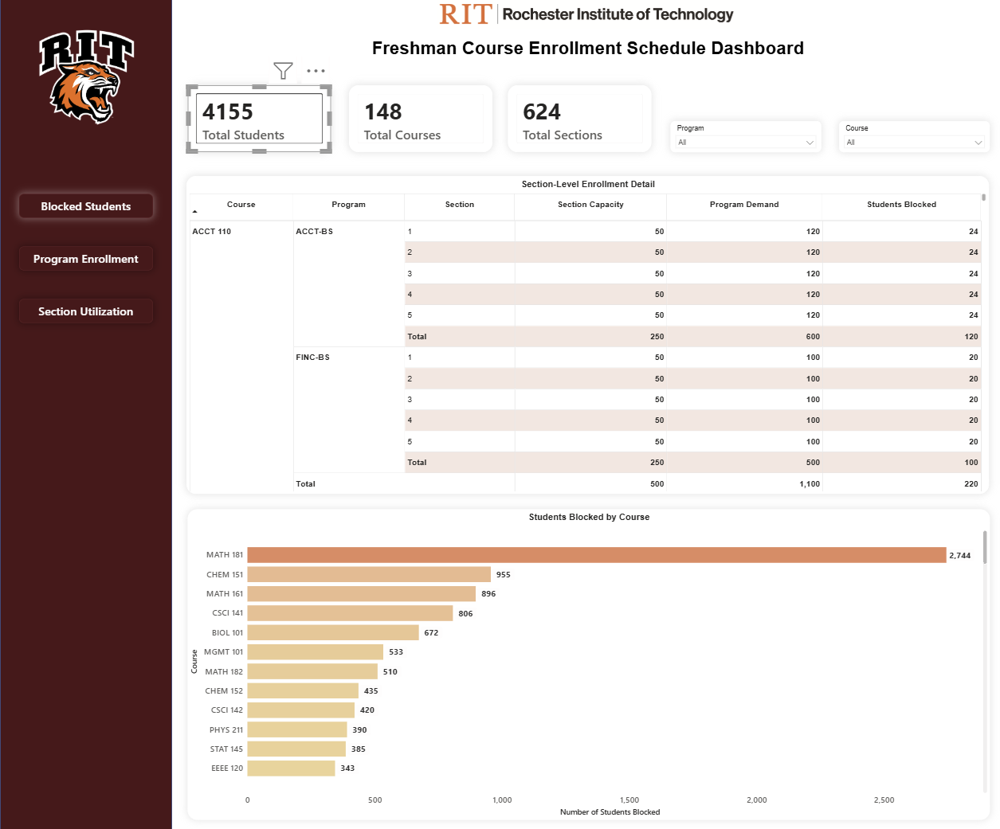
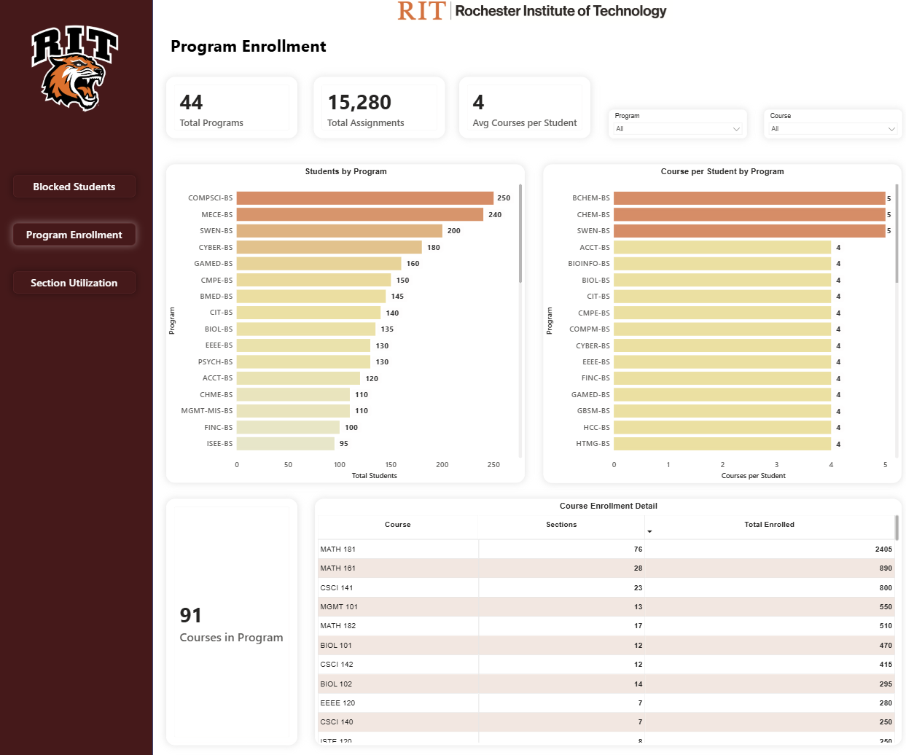
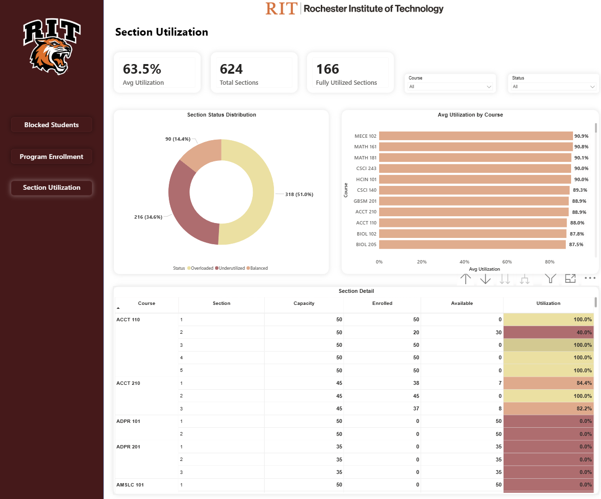

# Automated Freshman Course Scheduling — LLM-Generated Constraints + CP-SAT Optimization

An end-to-end course-scheduling system that assigns **4,155 freshmen to 634 sections** under hard institutional policies — where the policies are written in plain English by an administrator and translated into verified solver constraints by an LLM, then optimized with Google OR-Tools CP-SAT.

**Stack:** Python · Google OR-Tools (CP-SAT) · Anthropic Claude Sonnet API · Power BI.

> Capstone Project — Rochester Institute of Technology, Golisano College of Computing and Information Sciences.

---

## Why this project

At RIT, with 44 different academic programs and over 4,000 incoming freshmen every semester, scheduling is done manually. Staff spend weeks in trial-and-error: assigning students to sections without creating time conflicts, overfilling classrooms, or missing program requirements. Even after all that effort, the results aren't optimal — some sections end up packed while others sit half-empty. And every new program or course makes the problem exponentially harder.

The deeper problem is a translation gap: the people who *own* the scheduling policies aren't the people who can *encode* them. An administrator knows "no more than a quarter of an intro CS section should go to CS majors, so other programs can get seats" — but turning that sentence into a correct constraint over hundreds of thousands of decision variables requires optimization expertise they don't have. So policies get applied inconsistently, or not at all.

This project automates the full pipeline. It is built around one idea: **let the administrator write the policy in English, and make the machine responsible for translating it correctly and proving it's safe to run.** Three layers make this work:

1. **Natural-language constraint generation** — an LLM turns a plain-English policy into CP-SAT constraint code.
2. **Verification** — generated code is validated for syntax and safety *before* it ever touches the solver.
3. **Optimization** — CP-SAT assigns students to sections, respecting every active constraint, with zero time conflicts.

---

## Architecture

```
Plain-English policy
        │  llm_interface.py
        ▼
LLM constraint generation        (Claude Sonnet API; 44 exact program names injected)
        │  llm_constraint_generator.py
        ▼
Verification                     (syntax + semantic check; regex reject of unknown program codes;
        │  verify_constraints.py   security scan blocks file access, imports, dynamic execution)
        ▼
Constraint loading               (inject validated constraints into the model)
        │  constraint_loader.py
        ▼
CP-SAT optimization              (8 workers · 300s limit · zero time conflicts)
        │  constraint_scheduler.py  +  data_validation.py
        ▼
Orchestration → output CSVs      (pipeline.py)
        │
        ▼
Power BI dashboard (3 pages)
```

---

## Analytical & engineering products

### 1. Natural-language → CP-SAT constraint generation

An administrator types a policy; the LLM returns runnable constraint code. Example:

**Input:**
```
No more than 25% of seats in any CSCI 141 section should go to Computer Science BS students.
```

**Generated:**
```python
# 25% cap: COMPSCI-BS students per CSCI-141 section
for section_id in csci141_sections:
    cap = int(section_capacities[section_id] * 0.25)
    model.Add(
        sum(x[s, section_id] for s in compsci_bs_students
            if (s, section_id) in x) <= cap
    )
```

Six constraint types tested: percentage caps, even distribution, infeasible detection, multi-program groups, exclusion rules, minimum enrollment. All generated code hit **100% syntax and semantic validity**, zero security violations, zero program hallucinations.

### 2. Hallucination prevention — the part that actually matters

An LLM writing code against a real schema will invent program names that don't exist, and a single bad identifier silently breaks a constraint. Two defenses handle this:

- **All 44 program names are injected into the prompt** with strict instructions to use only those.
- **Post-generation regex validation** rejects any code referencing a program code not in the known set — the generated constraint is thrown out *before* it reaches the solver, not after it corrupts a run.

This is the difference between a demo and something an administrator could trust.

### 3. Proactive data validation

Before the solver ever runs, a 7-check validation pipeline runs in 28 seconds:
- File structure, data integrity, math placement distributions
- **N-way conflict detection** — verifies all required courses for a program can actually be scheduled simultaneously (not just pairwise)
- **Effective capacity analysis** — confirms seats exist in non-conflicting combinations, not just in aggregate

Catching data problems in 28 seconds beats waiting 302 seconds for the solver to fail.

### 4. CP-SAT scheduling model

317,431 binary decision variables, 453,158 constraints. The solver runs with **8 search workers** (of 16 cores — deliberately capped to preserve system responsiveness) and a **300-second** time limit.

---

## Key findings

- **The 25% CSCI 141 cap is the headline result.** Applying it cut maximum section enrollment from **28 → 10 students** across all CSCI 141 sections — a concrete, visible redistribution driven entirely by an English-language policy.
- **Hard constraints beat soft constraints for distribution.** A soft-constraint formulation could actually *worsen* the spread (standard deviation went up); the hard cap improved it — a counterintuitive but important finding.
- **Constraint stacking has a ceiling.** Two simultaneous constraints solved cleanly; three or more pushed the solver past the 300s limit. A real scalability boundary, reported as found.
- **Infeasibility is detected, not faked.** Deliberately tight capacity correctly drives the solver to UNKNOWN/infeasible rather than returning a silently-wrong schedule.
- **Section load balancing works.** Enrollment standard deviation averaged 4.2 students across multi-section courses — no extreme cases of packed sections beside empty ones.

---

## System performance

| Metric | Result |
|---|---|
| Students Scheduled | 4,155 / 4,155 |
| Feasibility Rate | 100% |
| Time Conflicts | 0 |
| Solver Status | FEASIBLE |
| Solver Time | 302 seconds |
| Section Load StdDev | 4.2 students |
| Validation Time | 28 seconds |
| LLM Syntax Validity | 100% |
| LLM Semantic Validity | 100% |
| Program Hallucinations | 0 |
| Security Violations | 0 |

---

## Engineering & data-quality notes

- **API error handling distinguishes failure types.** A 529 overload error retries with a clean prompt; a validation error retries with the error fed back in. Retry delays are staged (5s / 10s). Treating these the same would either waste retries or fail to self-correct.
- **Demand allocation is computed from input, independent of solver output.** `section_program_breakdown.csv` is derived purely from input data — the analysis doesn't secretly depend on one particular solver run.
- **Dashboard source discipline.** Power BI reads only *output* files, never input files, so the dashboard always reflects an actual scheduling result rather than pre-solve assumptions.
- **Reproducibility caveat.** The baseline objective value is not stable between runs and is not reported as a headline metric. The stable, reportable facts are 100% feasibility, zero time conflicts, and zero violations.

---

## Honest limitations

This is a **synthetic dataset**, modeled on RIT's program structure but not real enrollment. Program names, course codes, and requirement logic mirror RIT's actual curriculum; enrollment numbers, section counts, and meeting times are generated.

The solver returns **FEASIBLE, not OPTIMAL**, within the 300s budget — appropriate for an NP-hard timetabling problem at this scale. Three-plus stacked constraints can time out. The LLM interface is command-line only; a production system would need a web interface.

This is reported as-is. The value of the project is the end-to-end capability applied correctly — on real enrollment data, the same pipeline carries over directly.

---

## Dataset

| Attribute | Value |
|---|---|
| Programs | 44 |
| Students | 4,155 |
| Sections | 634 |
| Courses | 148 |
| Total capacity | 25,187 |
| Total demand | 15,274 |
| Capacity utilization | 60.6% |
| Decision variables | 317,431 |
| Total constraints | 453,158 |

Input files: `course_sections.csv`, `program_course_requirements.csv`, `program_cohort_distribution.csv`. Student records are generated at runtime from the cohort distribution.

---

## Repository structure

```
src/
  pipeline.py                  End-to-end orchestration
  data_validation.py           7-check proactive validation pipeline
  constraint_scheduler.py      Core CP-SAT scheduling model
  constraint_loader.py         Injects validated constraints into the model
  llm_interface.py             Admin-facing plain-English interface
  llm_constraint_generator.py  Claude API → CP-SAT constraint code
  verify_constraints.py        Syntax, semantic, and security validation
config/
  llm_config.yaml              LLM configuration (model, prompts, retry logic)
data/
  course_sections.csv          Synthetic — see data/README.md
  program_course_requirements.csv
  program_cohort_distribution.csv
outputs/
  20260419_203351/             Sample baseline run
dashboard/
  scheduler_dashboard.pbix     Power BI dashboard (3 pages)
  screenshots/
docs/
  poster.pdf                   Capstone poster
  report.pdf                   Full capstone report
```

---

## Setup

```bash
git clone https://github.com/priyaa279/freshman-course-scheduler.git
cd freshman-course-scheduler
pip install -r requirements.txt
cp .env.example .env          # add your Anthropic API key
```

Run the baseline (no constraints):
```bash
python src/pipeline.py
```

Run with plain-English constraints:
```bash
python src/llm_interface.py
```

---

## Dashboard

Three pages in Power BI Desktop, built from output CSVs only.

### Blocked Students



Students blocked or redistributed by active cap constraints — the visible effect of an English-language policy on section assignments.

### Program Enrollment



Per-program enrollment bars comparing assigned students against capacity across all 44 programs.

### Section Utilization



Color-coded section fill rates: underutilized (< 50%), balanced (50–90%), near-capacity (> 90%).

---

## One-line summary

> Built an end-to-end freshman scheduling system for RIT (4,155 students, 634 sections) that replaces weeks of manual trial-and-error: administrators write policies in plain English, an LLM translates them into verified CP-SAT constraints with hallucination guards, and Google OR-Tools finds a conflict-free assignment in 302 seconds. A single English policy (25% CS cap on intro CS) cut max section enrollment from 28 to 10.

---

## License

MIT
